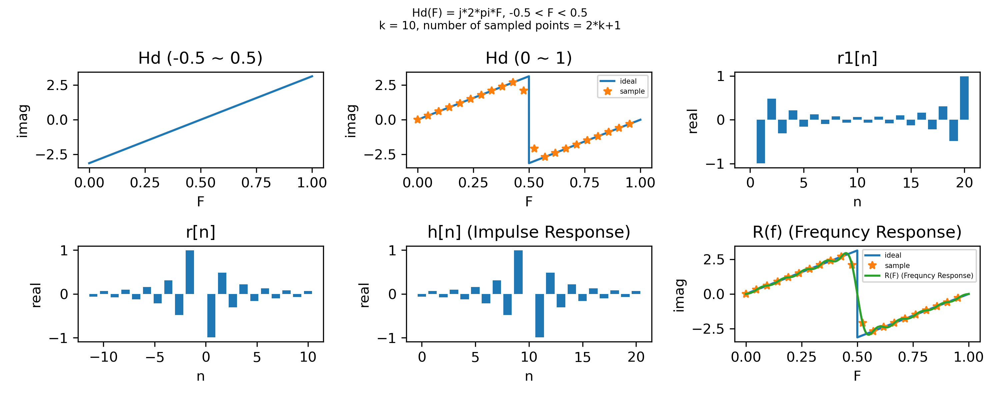

## Frequency Sampling
---
## Target: Compute the filter of Hs(F) = j * 2 * pi * F, -0.5 < F < 0.5,  with frequency sampling method
- step1: Duplicate values of Hs(F), -0.5 < F < 0 to 0.5 < F < 1 ( Hs(F) = Hs(F+1) ).
- step2: Sample r0 on Hs(F) with interval 1/N, N = 2*k+1 (allowed transition band on k, k+1).
- step3: Use inverse discrete Fourior transform to transform r0 to r1[n].
- step4: Cut values of r1[n], k < n <= N to -k <= n < 0 to generate r[n].
- step5: Shift r[n] with k to generate impulse response h[n].
- step6: Use discrete Fourior transform to find R(F) = DFT(r[n]).

## Results with k = 10


## Execute
- Environment: Python 3.8
- Install packages: 
```
 pip3 install -r requirements.txt
```

<div style="break-after: page; page-break-after: always;"></div>

- Use default parameter k = 10: 
```
python3 main.py
```
- Use costom parameter
```
python3 main.py --k {k} 
```
---
## Output:
- Ideal Filter Hd(F) (-0.5 ~ 0.5)
- Ideal Filter Hd(F) (0 ~ 1) with sampling points
- r0
- r1[n]
- r[n]
- Impulse response h[n]
- Frequency response R(F) with Filter Hd(F) (0 ~ 1) and sampling points
